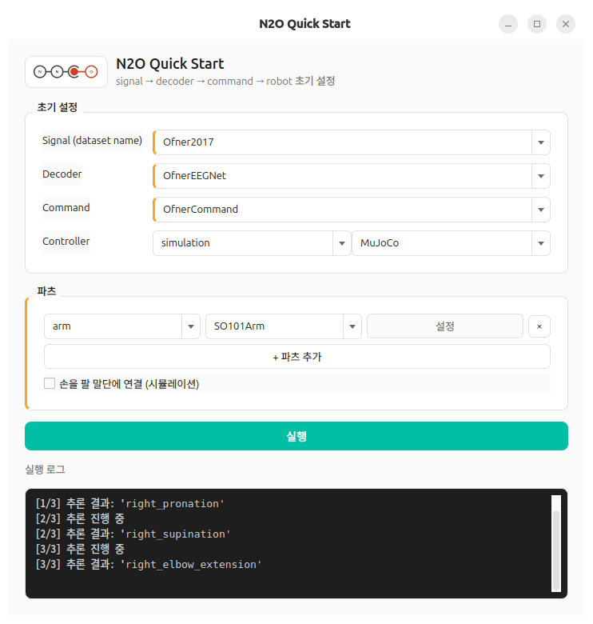
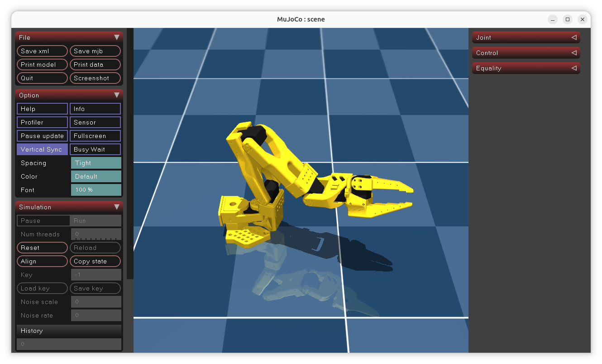

<p align="center">
  
</p>

<p align="center">
  <a href="https://github.com/EA-park/neural-to-output/actions/workflows/ci.yml"></a>
  <a href="https://github.com/EA-park/neural-to-output/actions/workflows/docs.yml"></a>
  <a href="LICENSE"></a>
  
</p>

# N2O: Neural signal to Output in the real world

An open-source framework for translating human electrophysiological signals (EEG/EMG)
into robot actions. The pipeline is fixed: a `signal` source is decoded by a `decoder`
into a raw prediction, which a `command` translates into per-part actions sent to a
`robot`'s `arm`/`hand`/`camera`.

## Installation

Not yet published to PyPI. Clone the repository and install with [uv](https://docs.astral.sh/uv/):

```bash
git clone https://github.com/EA-park/neural-to-output.git
cd neural-to-output
uv sync
```

## Quick Start

[`demos/quickstart.py`](demos/quickstart.py) wires a real EEG dataset, decoder, and
`AmazingHand` together and drives it through the pipeline. It needs the `examples`
dependency group (`mujoco`, for the simulated run below):

```bash
uv sync --group examples
uv run python demos/quickstart.py
```

```python
from n2o import N2O
from n2o.signal.dataset import DatasetLoader
from n2o.decoder import OfnerEEGNet
from n2o.command import OfnerCommand
from n2o.robot.hand import AmazingHand

n2o = N2O()
n2o.signal = DatasetLoader(name="Ofner2017")
n2o.decoder = OfnerEEGNet()
n2o.command = OfnerCommand()
n2o.robot.hand = AmazingHand(port="/dev/ttyACM1")
n2o.run(controller="simulation")  # or "motor_driver" to drive the real hand
```

See [demos/](demos/) for more standalone applications, or
[docs/](https://ea-park.github.io/neural-to-output/) for how the pipeline's pieces fit
together -- or the Tutorials below for step-by-step notebooks.

## Tutorials

Numbered, self-contained Jupyter notebooks under [`examples/`](examples/), meant to be
worked through in order:

1. [`01_explore_eeg_dataset.ipynb`](examples/01_explore_eeg_dataset.ipynb) -- browse the
   registered dataset library and inspect one dataset's metadata, then preprocess and
   window a raw recording step by step.
2. [`02_add_custom_dataset.ipynb`](examples/02_add_custom_dataset.ipynb) -- register a
   local recording that isn't covered by the moabb-backed library.
3. [`03_explore_eegnet_decoder.ipynb`](examples/03_explore_eegnet_decoder.ipynb) -- build
   a `BraindecodeDecoder` (`EEGNet`) and run real inference with a pretrained checkpoint,
   no training required.
4. [`04_hand_intent_classification_amazinghand.ipynb`](examples/04_hand_intent_classification_amazinghand.ipynb) --
   classify EEG into a `"grip"`/`"spread"` hand command and drive a simulated
   `AmazingHand` end to end.
5. [`05_finger_regression_amazinghand.ipynb`](examples/05_finger_regression_amazinghand.ipynb) --
   same shape as `04`, but regressing continuous per-finger flexion instead of a
   discrete label.
6. [`06_official_simulation_arm_and_hand.ipynb`](examples/06_official_simulation_arm_and_hand.ipynb) --
   drive `robot.arm` and `robot.hand` together from one classifier, visualized against
   each vendor's official CAD-derived simulation model.
7. [`07_regression_arm_and_hand.ipynb`](examples/07_regression_arm_and_hand.ipynb) --
   `06`'s continuous counterpart: real per-joint arm angles and finger flexion from one
   regression decoder.
8. [`08_mixed_classification_regression.ipynb`](examples/08_mixed_classification_regression.ipynb) --
   one decoder wrapping two independent models (classification + regression) and a
   Cartesian relative-step IK solve for the arm.
9. [`09_real_so101_arm_control.ipynb`](examples/09_real_so101_arm_control.ipynb) -- `08`'s
   decoder/command unchanged, but driving a **real** SO-101 arm instead of the
   simulation -- bring-up, calibration, and safety notes included.
10. [`10_py_trees_task_coordination.ipynb`](examples/10_py_trees_task_coordination.ipynb) --
    explores [`py_trees`](https://github.com/splintered-reality/py_trees) behaviour trees
    as a candidate for sequencing/coordinating across multiple robot parts and stations.

## Desktop App

[`apps/console.py`](apps/README.md) is a PySide6 desktop console over the same
signal → decoder → command → robot wiring as the Quick Start above -- pick a dataset,
decoder, and command from dropdowns, add robot parts, then run, no code required.
Needs its own `app` dependency group:

```bash
uv sync --group app
uv run --group app python apps/console.py
```

<p align="center">
  
  
</p>

See [apps/README.md](apps/README.md) for details, including the desktop launcher entry.

## Unity Simulation (optional)

The Desktop App's Controller can also target a live [Unity](https://unity.com/)
scene instead of the built-in MuJoCo viewer -- useful for visualizing/driving a
rig with Unity's own engine, either via the official MuJoCo Unity plugin or a
from-scratch `ArticulationBody` rig. n2o only ever talks to it over a plain TCP
socket ([`UnitySimulator`](src/n2o/robot/simulation/unity/unity_simulator.py));
it never launches, manages, or embeds Unity itself, so this is a separate,
one-time setup outside n2o.

The Unity-side project (an open project with no baked-in robot -- bring your
own `rig.json`/meshes) is a separate repo:

```bash
git clone https://github.com/EA-park/neural-to-output-unity.git
```

Open it with [Unity Hub](https://unity.com/download), then follow its own
[README](https://github.com/EA-park/neural-to-output-unity#readme) for the two
supported engines (the official MuJoCo Unity plugin, or the `ArticulationBody`
rig built from a `rig.json` this project's own `ClosedLoopRigSolver` generates
-- the Desktop App's part settings dialog has a "rig.json 재생성" button for
this) and its one-click `Tools → N2O` scene setup menu.

## Feedback

Found a bug or have a feature request? Please
[open an issue](https://github.com/EA-park/neural-to-output/issues).
