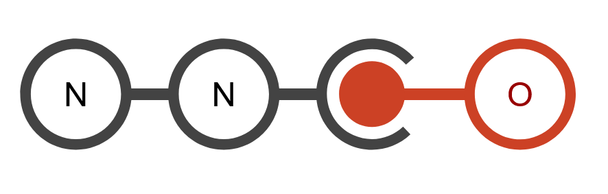

<p align="center">
  
</p>

<p align="center">
  <a href="https://github.com/EA-park/neural-to-output/actions/workflows/ci.yml"></a>
  <a href="https://github.com/EA-park/neural-to-output/actions/workflows/docs.yml"></a>
  <a href="LICENSE"></a>
  
</p>

# neural-to-output

An open-source framework for translating human electrophysiological signals (EEG/EMG)
into robot actions. The pipeline is fixed: a `signal` source is decoded by a `decoder`
into a raw prediction, which a `command` translates into per-part actions sent to a
`robot`'s `arm`/`hand`/`camera`.

## Install

Not yet published to PyPI. Clone the repository and install with [uv](https://docs.astral.sh/uv/):

```bash
git clone https://github.com/EA-park/neural-to-output.git
cd neural-to-output
uv sync
```

## Quickstart

[`demos/quickstart.py`](demos/quickstart.py) wires a real EEG dataset, decoder, and
`AmazingHand` together and drives it through the pipeline. It needs the `examples`
dependency group (`mujoco`, for the simulated run below):

```bash
uv sync --group examples
uv run python demos/quickstart.py
```

```python
from n2o import N2O
from n2o.signal.dataset import DatasetLoader
from n2o.decoder import OfnerEEGNet
from n2o.command import OfnerCommand
from n2o.robot.hand import AmazingHand

n2o = N2O()
n2o.signal = DatasetLoader(name="Ofner2017")
n2o.decoder = OfnerEEGNet()
n2o.command = OfnerCommand()
n2o.robot.hand = AmazingHand(port="/dev/ttyACM1")
n2o.run(controller="simulation")  # or "motor_driver" to drive the real hand
```

See [demos/](demos/) for more standalone applications, or [examples/](examples/) for
the numbered tutorial notebooks.

## What each layer needs to decide

| Layer  | Decisions |
| ------ | --------- |
| Signal | Which dataset/library to read from, and the cue-relative data range (start~end seconds around each cue) |
